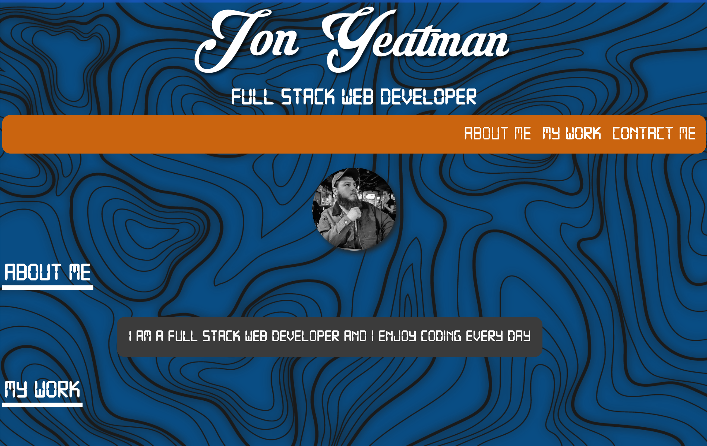

# personal-portfolio

https://yeatman51.github.io/personal-portfolio/#my-work

https://github.com/Yeatman51/personal-portfolio

## This is my personal portfolio page

I included a custom background and custom font to create a certain branded look to the page. I also added a unique Name image at the beginning of the page.

I tried to utilize wax box to make the layout as mobile friendly and scalable as possible

I added links for my email github and LinkedIn accounts there are also icons for each respective media account all of these accounts will open in a new tab

I implemented a hover state within the mouth bar to add a more professional look and clear clickable features to take you to different sections of the page

I have two project examples in my body both of these are background images that will link you to another page to explore both of those projects

